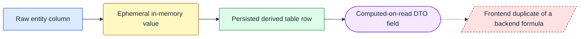
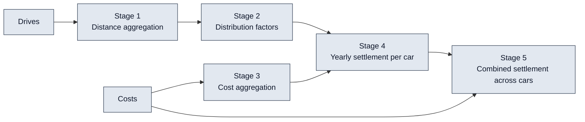
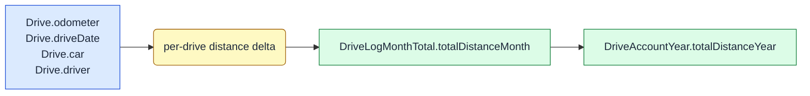
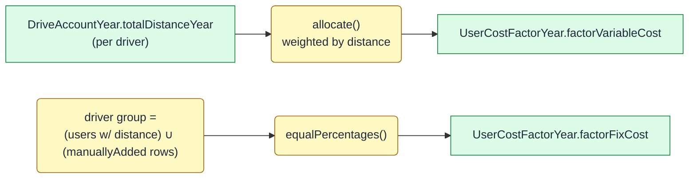
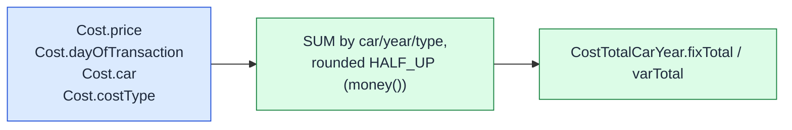
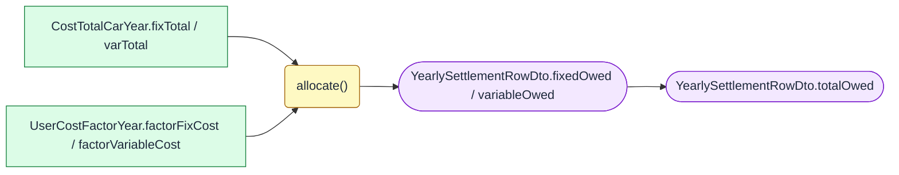
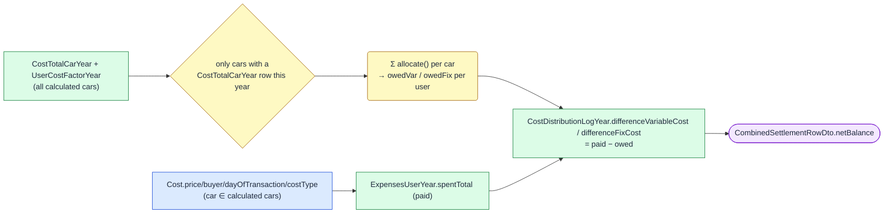

# Calculation Data Dependencies

This document is the authoritative reference for how every calculated/derived
value in the app is produced — which raw database columns (and which other
derived values) feed into it, what the exact formula and rounding rule is,
where the result is persisted or exposed, and which frontend screen consumes it.

All calculation logic lives in
[`CalculationService.java`](../backend/src/main/java/de/digidrivelog/services/CalculationService.java),
exposed via `CalculationController` under `/ddl/api/calculations` (request/
response shapes: [`api_doc.yaml`](./api_doc.yaml)). The raw entity schema is
in [`digitalDriveLog-database.json`](./digitalDriveLog-database.json) (a [drawdb.app](https://drawdb.app) export);
this document does not repeat every raw column, only the ones that feed a calculation.

This should document the existing behavior.

## How to read the diagrams

Each diagram below uses the same four node styles, so the shape/fill tells
you what kind of thing a node is without re-reading the legend every time:

- **raw** (blue, rectangle) — a column straight from `Car`, `User`, `Cost`, or `Drive`.
- **computed** (yellow, rounded) — an in-memory value with no table of its own (e.g. a per-drive odometer delta).
- **persisted** (green, rectangle) — a row in one of the derived tables (`DriveLogMonthTotal`, `DriveAccountYear`, `CostTotalCarYear`, `UserCostFactorYear`, `ExpensesUserYear`, `CostDistributionLogYear`).
- **dto** (purple, stadium) — a field on a response DTO that is recomputed on every `GET`, never written to a table.
- **duplicate** (red, dashed) — a second, independent implementation of a formula (currently only the frontend's live preview), flagged because it can drift from the backend if one side changes without the other.

## Overview

Stage 6 (preview-only calculations and a known frontend/backend duplication)
and the availability flags are documented separately at the end, since
neither feeds the persisted pipeline above.

## Full dependency tree (at a glance)

Everything below in one picture: every raw attribute, every derived value,
and every arrow between them, grouped into the same stages as the sections
that follow. Read it left-to-right like a sideways tree — a box only
depends on what's connected to it on its left. Use this diagram to see the
whole shape at once; use the per-stage diagrams further down for the
formula behind any one box.

```mermaid
flowchart LR
    classDef raw fill:#dbeafe,stroke:#1d4ed8,color:#1e293b;
    classDef computed fill:#fef9c3,stroke:#a16207,color:#1e293b;
    classDef persisted fill:#dcfce7,stroke:#15803d,color:#1e293b;
    classDef dto fill:#f3e8ff,stroke:#7e22ce,color:#1e293b;
    classDef duplicate fill:#fee2e2,stroke:#b91c1c,stroke-dasharray: 4 3,color:#1e293b;

    subgraph S1["Stage 1 · Distance aggregation"]
        direction LR
        Drive["Drive.odometer / driveDate / car / driver"]:::raw --> Delta("per-drive delta"):::computed
        Delta --> MonthTotal["DriveLogMonthTotal.totalDistanceMonth"]:::persisted
        MonthTotal --> YearDist["DriveAccountYear.totalDistanceYear"]:::persisted
    end

    subgraph S2["Stage 2 · Distribution factors"]
        direction LR
        Group("driver group =\nusers w/ distance ∪ manuallyAdded"):::computed --> EqualPct("equalPercentages()"):::computed
        EqualPct --> FixFactor["UserCostFactorYear.factorFixCost"]:::persisted
        AllocVar("allocate()\nweighted by distance"):::computed --> VarFactor["UserCostFactorYear.factorVariableCost"]:::persisted
    end
    YearDist --> AllocVar
    YearDist --> Group

    subgraph S3["Stage 3 · Cost aggregation"]
        direction LR
        Cost["Cost.price / dayOfTransaction / car / costType"]:::raw --> CostSum("SUM by car/year/type,\nmoney() HALF_UP"):::computed
        CostSum --> CarTotals["CostTotalCarYear.fixTotal / varTotal"]:::persisted
    end

    subgraph S4["Stage 4 · Yearly settlement"]
        direction LR
        AllocYearly("allocate()"):::computed --> Owed(["YearlySettlementRowDto.fixedOwed / variableOwed"]):::dto
        Owed --> TotalOwed(["YearlySettlementRowDto.totalOwed"]):::dto
    end
    CarTotals --> AllocYearly
    VarFactor --> AllocYearly
    FixFactor --> AllocYearly

    subgraph S5["Stage 5 · Combined settlement"]
        direction LR
        Filter{"only cars with a\nCostTotalCarYear row"}:::computed --> SumAlloc("Σ allocate() per car →\nowedVar / owedFix"):::computed
        Buyer["Cost.buyer, price,\ndayOfTransaction, costType"]:::raw --> Spent["ExpensesUserYear.spentTotal"]:::persisted
        SumAlloc --> Diff["CostDistributionLogYear.\ndifferenceVariableCost / differenceFixCost"]:::persisted
        Spent --> Diff
        Diff --> Net(["CombinedSettlementRowDto.netBalance"]):::dto
    end
    CarTotals --> Filter
    VarFactor --> Filter
    FixFactor --> Filter

    subgraph S6["Stage 6 · Preview & duplication"]
        direction LR
        Preview(["ParticipantRowDto.fixShare / varShare"]):::dto
        Dup["calculation-hub.component.ts\nallocate() (JS, Math.round)"]:::duplicate -.same algorithm.-> Preview
    end
    YearDist -.-> Preview
    Group -.-> Preview
```

---

## Stage 1 — Distance aggregation

**Per-drive distance delta**
- Inputs: `Drive.odometer`, `Drive.driveDate`, `Drive.car`, `Drive.driver`.
- Formula: drives for a car are ordered by odometer then date
  (`DriveRepository.findByCarCarIdOrderByOdometerAscDriveDateAsc`); for each
  consecutive pair, `delta = drive[i].odometer - drive[i-1].odometer`. Only
  deltas `> 0` whose `driveDate.year == year` are kept, bucketed by
  `driveDate`'s month and `drive.driver`.
- Rounding: none (integer km).
- Persisted as: not persisted itself — feeds Stage 1's next value directly.
- Source: `CalculationService.distanceByMonthAndDriver`.

**`DriveLogMonthTotal.totalDistanceMonth`**
- Inputs: sum of the per-drive deltas above for one `(car, year, month, driver)`.
- Formula: `aggregateMonth()` sums deltas for a single requested month;
  `aggregateMissingMonths()` does the same for every month that
  has drives but hasn't been aggregated yet, run as part of a yearly
  calculation.
- Persisted as: `drive_log_month_total` (PK `year, month, userId, carId`).
- Exposed via: `GET /calculations/monthly` → `MonthlyDistanceDto` (`getMonthlyDistances`).
- Frontend consumer: `monthly-distances.component.ts` (results tab).
- Source: `CalculationService.java`.

**`DriveAccountYear.totalDistanceYear`**
- Inputs: `DriveLogMonthTotal.totalDistanceMonth` for all months of the year, per `(car, driver)`.
- Formula: plain sum across the year's month rows (`calculateYear`;
  same rollup reused read-only as `yearlyDistanceByDriver`).
- Rounding: none (integer km).
- Persisted as: `drive_account_year` (PK `year, userId, carId`).
- Exposed via: displayed as `distance` in `YearlySettlementRowDto` (Stage 4) and `ParticipantRowDto.distance` (Stage 6).
- Source: `CalculationService.java`.

---

## Stage 2 — Distribution factors

Three or more downstream values (this stage and Stages 4-5) all reuse the
same allocation rule, so it's documented here once instead of repeated at
every call site:

> **`allocate(total, users, weightByUser)`** — splits `total` across `users`
> in proportion to `weightByUser`, each share rounded HALF_UP to 2 decimals.
> The **last user in the (sorted) list absorbs the rounding remainder** —
> their share is `total - sum(all previous shares)` — so the column always
> sums to exactly `total`, never off by a cent. If every weight is zero, the
> split falls back to an even share per user (still remainder-on-last).
> Source: `CalculationService.allocate`.
>
> `percentagesByWeight(users, weights)` = `allocate(100.00, users, weights)`.
> `equalPercentages(users)` = `allocate(100.00, users, weight=1
> for everyone)` — a specialization, not a separate rule.

**`UserCostFactorYear.factorVariableCost`** (percentage, 0-100, 2dp)
- Inputs: `DriveAccountYear.totalDistanceYear` per driver.
- Formula: `percentagesByWeight(drivers, weight = totalDistanceYear)`.
- Persisted as: `user_cost_factor_year.factor_variable_cost`.
- Source: `CalculationService.java`.

**`UserCostFactorYear.factorFixCost`** (percentage, 0-100, 2dp)
- Inputs: only the driver-group **size** — no cost or distance data. The
  group is `(users with an aggregated DriveAccountYear row) ∪ (users with a
  manuallyAdded UserCostFactorYear row)` — i.e. drivers plus anyone added on
  the participants screen.
- Formula: `equalPercentages(drivers)`; an equal share for every
  member of the group, e.g. 3 people → 33.33/33.33/33.34.
- Persisted as: `user_cost_factor_year.factor_fix_cost`.
- Source: `CalculationService.java`.

---

## Stage 3 — Cost aggregation

**`CostTotalCarYear.fixTotal` / `varTotal`**
- Inputs: `Cost.price`, `Cost.dayOfTransaction`, `Cost.car`, `Cost.costType`.
- Formula: `sum(price)` filtered to one car/year, split by `costType`
  (`CostRepository.sumPriceByCarYearAndType`, `CostRepository.java`),
  then rounded to 2 decimals via the shared `money()` helper (HALF_UP,
  `CalculationService.java`) — `money()` is the same rounding helper
  used again in Stage 5.
- Persisted as: `cost_total_car_year` (PK `year, carId`).
- Source: `CalculationService.java`, `CostRepository.java`.

---

## Stage 4 — Yearly settlement (per car)

Unlike Stages 1-3, this stage is **not persisted** — it's recomputed from
the tables above on every `GET`.

**`YearlySettlementRowDto.variableOwed` / `fixedOwed`**
- Inputs: `CostTotalCarYear.varTotal`/`fixTotal` and
  `UserCostFactorYear.factorVariableCost`/`factorFixCost` for the same car/year.
- Formula: `allocate(varTotal, drivers, factorVariableCost)` and
  `allocate(fixTotal, drivers, factorFixCost)` — the shared allocation rule
  from Stage 2, applied to money instead of percentages.
- `totalOwed = variableOwed + fixedOwed`.
- Exposed via: `GET /calculations/yearly` → `getYearlySettlement()`.
- Frontend consumer: `yearly-settlement.component.ts`. That component's
  `totals` signal is a plain client-side `reduce` over already-computed
  rows for a totals row — not a new formula, just re-summing what the backend returned.
- Source: `CalculationService.java`.

---

## Stage 5 — Combined settlement (across all calculated cars)

**`ExpensesUserYear.spentTotal`** (what a user actually paid, across all
calculated cars for the year)
- Inputs: `Cost.price`, `Cost.buyer`, `Cost.dayOfTransaction`, `Cost.costType`,
  restricted to `Cost.car ∈` the set of cars that have a `CostTotalCarYear`
  row for that year — **this restriction is deliberate**: it's what keeps
  paid and owed reconciling to exactly zero net across the group. Costs for
  a car whose year hasn't been calculated yet are silently excluded from
  both sides until that car is calculated.
- Formula: `paidVar = sum(price)` where `costType = VARIABLE`; `paidFix`
  likewise for `FIXED` (`CostRepository.sumPriceByUserYearTypeAndCars`,
  `CostRepository.java`); `spentTotal = paidVar + paidFix`.
- Persisted as: `expenses_user_year` (PK `year, userId`).
- Source: `CalculationService.recomputeCombined`.

**`CostDistributionLogYear.differenceVariableCost` / `differenceFixCost`**
- Inputs: for every calculated car, `CostTotalCarYear.{varTotal,fixTotal}` ×
  `UserCostFactorYear.{factorVariableCost,factorFixCost}` → `allocate()`
  (Stage 2's rule) summed per user across all those cars = `owedVar`/`owedFix`;
  and the `paidVar`/`paidFix` values from `ExpensesUserYear` above.
- Formula: `differenceVariableCost = paidVar - owedVar`,
  `differenceFixCost = paidFix - owedFix`.
- Persisted as: `cost_distribution_log_year` (PK `year, userId`).
- Source: `CalculationService.java`.

**`CombinedSettlementRowDto.netBalance`**
- Inputs: `CostDistributionLogYear.differenceVariableCost` + `differenceFixCost`.
- Formula: `netBalance = differenceVariableCost + differenceFixCost`
  (positive = the group owes the driver money back).
- Exposed via: `GET /calculations/combined` → `getCombined()`).
- Frontend consumer: `combined-settlement.component.ts`. Its `totals` signal
  is again a plain client-side re-summation of rows for a totals
  row, not a new formula.
- Source: `CalculationService.java`.

---

## Stage 6 — Preview-only and duplicated-logic paths

These are **not** part of the persisted pipeline above; kept in their own
section so they aren't mistaken for it.

**`ParticipantRowDto.fixShare` / `varShare`** (preview only, never persisted)
- Inputs: same as Stage 2, but computed against the *candidate* participant
  set (drivers ∪ manually-added, before the user saves) rather than the
  persisted run.
- Formula: identical to Stage 2's `equalPercentages()`/`percentagesByWeight()`.
- Exposed via: `GET /calculations/participants` → `getParticipants()`.
- Frontend consumer: `calculation-hub.component.ts` (participant management screen, issue #32).
- Source: `CalculationService.java`.

**Frontend duplication (known, accepted)** — `calculation-hub.component.ts`
reimplements the same `allocate()` algorithm in TypeScript, used
for an *instant* checkbox-toggle preview before the user saves the
participant set (so the preview doesn't need a round trip for every click).
It rounds with `Math.round(x * 100) / 100` instead of the backend's
`BigDecimal` `HALF_UP`, which can disagree with the backend by a cent on
some inputs. This is an accepted tradeoff for UI responsiveness, not a bug —
but it is a second, independently-maintained copy of the allocation formula,
so a future change to the backend's rounding/remainder rule must be mirrored
here manually.

**Not a formula** — `yearly-settlement.component.ts` and
`combined-settlement.component.ts` only re-sum already-computed row
fields (`reduce`) into a totals row; they introduce no new derived value.

---

## Availability flags (not calculations)

`GET /calculations/availability` → `getAvailability()` returns
existence-check booleans/lists used purely to colour the calculation
screens' year/month selectors — they are not numeric derivations and have no
diagram:

- `yearCalculated` — does a `CostTotalCarYear` row exist for `(car, year)`.
- `participantsStored` — does any `manuallyAdded = true` `UserCostFactorYear` row exist for `(car, year)`.
- `aggregatedMonths` — distinct months with a `DriveLogMonthTotal` row.
- `monthsWithDrives` — distinct months with at least one qualifying drive delta (Stage 1), whether or not aggregated yet.
